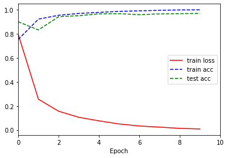

# 快速入门
快速入门主要介绍如何使用Mytorch搭建神经网络和进行训练
## 模块导入
```  python
from Mytorch.trainer.trainer import Trainer
from Mytorch.data.data_loader import MnistData
from Mytorch.torch.mlp import MLP
```

## 加载数据和模型
在这里我们导入了small_mnist数据和MLP模型。  
更多数据在  
更多模型可以在  

``` python
data = MnistDat("\dataset\mnist_small_matlabmat")
model =MLP()
model.show()
``` 


## 导入trainer 进行训练
``` python
trainer =Trainer(max_epochs=10)
trainer.fit(model,data)
``` 
```
Epoch: 10/10, loss: 0.009  train_acc: 0.999  test_acc: 0.969  examples/sec:94.9 
```

<iframe height=498 width=800 src="https://www.bilibili.com/video/BV1E14y1n7dh/?vd_source=77f197efc9e66a13ad8a2235a6cb34be">