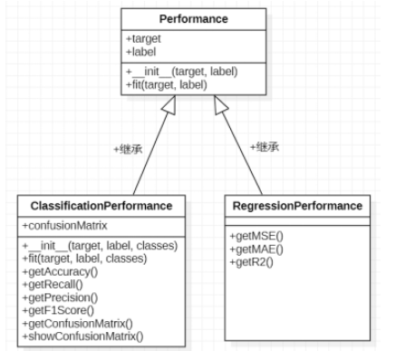

# Mytorch.evaluator

evaluator模块用于评估模型的性能指标，该模块里面存放了Performance类，ClassificationPerformance类，RegressionPerformance类。ClassificationPerformance类和RegressionPerformance类继承于Performance类。三个类之间的关系如下图所示：  

## (1)属性:
target: 模型对一批数据的预测值，类型numpy向量
label: 数据的真实值，类型为numpy向量
## (2)方法:
__init__(target, label): 构造方法，将target和label转换为numpy向量后存储
fit(target, label): 重新修改target和label
## (3)代码实现:
``` python
1.class Performance:
2.
3.    def __init__(self, target, labels):
4.        """
5.        构造函数，将传入列表要转换为numpy数组
6.        :param target: 预测值
7.        :param labels: 真实值
8.        """
9.        if not isinstance(target, np.ndarray):
10.            self.target = np.array(target)
11.        else:
12.            self.target = target
13.        if not isinstance(labels, np.ndarray):
14.            self.labels = np.array(labels)
15.        else:
16.            self.labels = labels
17.
18.    def fit(self, target, labels):
19.        """
20.        重新保存数据
21.        :param target: 预测值
22.        :param labels: 真实值
23.        :return:
24.        """
25.        self.target = np.array(target)
26.        self.labels = np.array(labels)
```