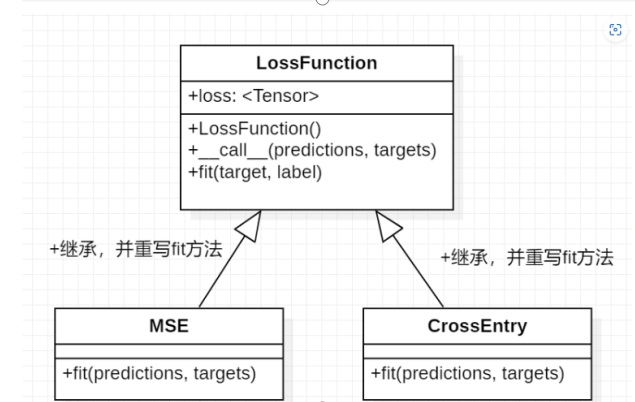

# Mytorch.loss
在loss这个模块中有一个抽象类LossFuncion和它的实现类MSE,crossentropy.  
损失函数（loss function）是将随机事件或其有关随机变量的取值映射为非负实数以表示该随机事件的“风险”或“损失”的函数。  
在应用中，损失函数通常作为学习准则与优化问题相联系，即通过最小化损失函数求解和评估模型。  
loss函数的作用就是描述模型的预测值与真实值之间的差距大小。寻找一个标准来帮助训练机制随时优化参数，以便于找到网络的最高精度下的参数。  
CrossEntropy

``` python
class CrossEntropy(LossFunction):
    def fit(self, predictions, targets):
        assert predictions.shape == targets.shape
        self.loss = -Tensor.sum((targets * Tensor.log(predictions)))
        return self.loss
```
MSE

``` python
class MSE(LossFunction):
    def fit(self, predictions, targets):
        assert predictions.shape == targets.shape
        return Tensor.sum((predictions-targets)*(predictions-targets)) / targets.shape[0]
``` 