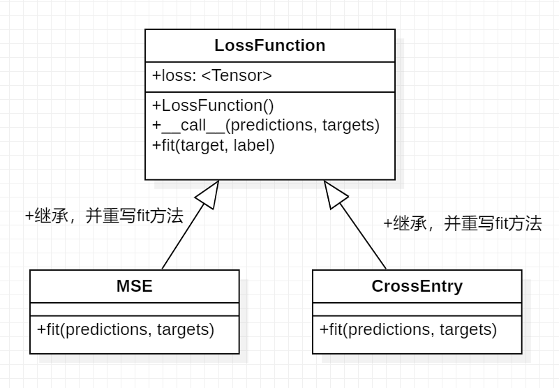

# Mytorch

文档： [https://yulinlina.github.io/Mytorch/  ](https://yulinlina.github.io/Mytorch/)  
## 简介
Mytorch是一个简化pytorch的深度学习框架，易于使用.依赖于numpy,Scikit-Learn,schemdraw实现有向图。它涵盖了训练模型的主要步骤和基本模型例如MLP、CNN。
它提供了多optim方法、评估器和损失函数。此外，它还提供了不同的数据集供用户下载，可以很容易地在训练中进行导入和处理  
This documentation is organized as followed:
- [快速开始](https://yulinlina.github.io/Mytorch/Chinese/usage.html)  
- [Mytorch.nn](https://yulinlina.github.io/Mytorch/Mytorch.nn.html)  
- [Mytorch.tensor](https://yulinlina.github.io/Mytorch/Mytorch.tensor.html) 
- [Mytorch.optim](https://yulinlina.github.io/Mytorch/Mytorch.optim.html) 
- [Mytorch.loss](https://yulinlina.github.io/Mytorch/Mytorch.loss.html) 
- [Mytorch.data](https://yulinlina.github.io/Mytorch/Mytorch.data.html) 
- [Mytorch.evaluator](https://yulinlina.github.io/Mytorch/Mytorch.evaluator;.html) 
- [English Documentation](https://yulinlina.github.io/Mytorch/Chinese/English.html)   
## 视频教程
[demo](https://www.bilibili.com/video/BV1E14y1n7dh/?vd_source=77f197efc9e66a13ad8a2235a6cb34be)  
[trainer](https://www.bilibili.com/video/BV1Y14y1n7HG/?vd_source=77f197efc9e66a13ad8a2235a6cb34be)  
 

## 模块设计
## 0. data  
类： DataLoad 
功能： 随机把数据分割成训练集和测试集
把数据转为tensor
 
## 1. nn
抽象类：module   

实现类：  
**Linear**  
**conv2**  
Batchnorm  
Maxpool  
dropout    
module.show 绘图  
实现类： MLP  
**自定义层数：Sequential**  
激活函数  

- **Relu**
- **Sigmoid**
- Softmax
## 2. loss 

MSE
Crossentropy
## 3. optim
### 抽象类 optimizer

- SGD
- Adam

## 4. tensor
实现自动梯度
计算tensor的梯度
保存tensor的梯度
## 5. evaluator

类： FP,TP,TN,PN四项 + 混淆矩阵
 

